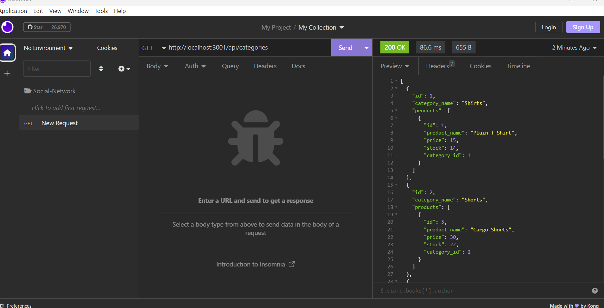

# E-Commerce 

## Description
Using Javascript and MySql, to have a resposive databases in Insomia. 
## Usage
When going into MySql and showing all the tables that is connected, we can run the server to have a connection to Insomia. Insomia will recieve the data base to display the tables it fetched. 
## Built With
* Javascript
* MySql
* Insomia
## Lisense
See `MIT LICENSE` for more information.
## Contact Me
* [Sabina Ceja-Siete](https://github.com/unisabi)
## Deployment 
https://github.com/unisabi/e-commerce
https://drive.google.com/file/d/1NXBIsGugCMKPA9tV9LDhwR8g6itbxOUR/view
